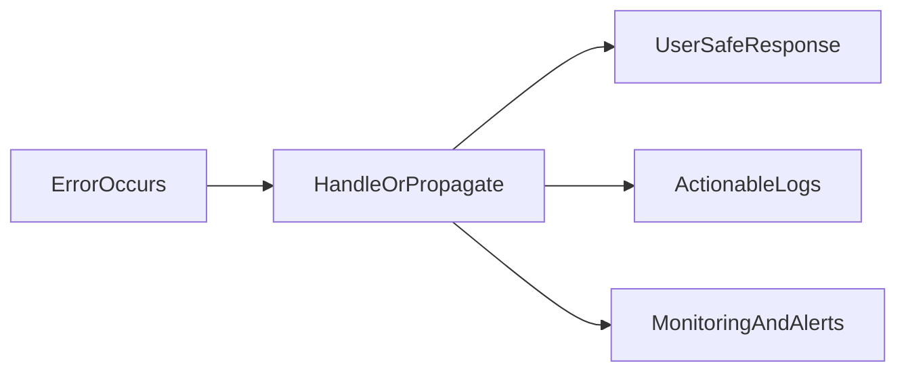

# Lesson 1: Introduction to Error Handling

## Learning Objectives

By the end of this lesson, you will be able to:
- Explain why error handling is essential for real-world production systems
- Distinguish between operational errors and programmer errors
- Understand how error handling improves UX, reliability, and debuggability
- Identify the main error-handling mechanisms across the stack (Node + React)
- Avoid common pitfalls (swallowing errors, leaking details, crashing the process)

## Why Error Handling Matters

Errors will happen in production. The question is whether your system:
- fails **gracefully** (good UX, safe responses, actionable logs)
- or fails **catastrophically** (crashes, data loss, silent failures)

Good error handling is the foundation for:
- **user trust**: clear, safe messages and retry paths
- **developer velocity**: faster debugging and safer refactors
- **operational reliability**: fewer crashes and easier incident response



## Why Error Handling?

- **User experience**: show safe, actionable messages (not stack traces)
- **Debugging**: capture context (request id, user id, inputs)
- **Monitoring**: track errors in production and prioritize fixes
- **Reliability**: prevent application crashes and cascading failures

## Error Types (Core Distinction)

### Operational Errors

Operational errors are expected failure cases in a running system:
- invalid user input
- database timeouts
- resource not found
- external API failures

These should be handled and translated into safe outcomes (usually 4xx/5xx responses).

```typescript
try {
  const user = await getUser(id);
  if (!user) {
    throw new Error("User not found"); // operational: expected not-found case
  }
} catch (error) {
  // Handle gracefully (return 404, log context, etc.)
}
```

### Programmer Errors

Programmer errors are bugs:
- null/undefined access
- logic errors
- incorrect assumptions about types or state

They are “unexpected” and typically indicate code fixes are needed.

```typescript
const user = null as any;
console.log(user.name); // TypeError: Cannot read property 'name' of null
```

## Error Handling Strategies (Across the Stack)

- **Try/catch**: handle synchronous code and `await` errors
- **Promise catch**: handle promise chains
- **Central error middleware** (backend): consistent HTTP error responses + logging
- **Error boundaries** (frontend): prevent UI crashes and show fallbacks

## Real-World Scenario: Login Flow Failures

Common failure cases:
- wrong password (401)
- account locked (403)
- DB down (503/500)

Good error handling:
- shows clear user messaging (“Invalid email or password”)
- logs what happened with context (request id, endpoint, user id)
- alerts if error rate spikes

## Best Practices

### 1) Make errors observable

An error that isn’t logged/monitored is effectively invisible.

### 2) Separate user messaging from developer diagnostics

Users get safe messages; logs/monitoring get the details.

### 3) Use a consistent error strategy

Consistent patterns reduce bugs and make systems easier to maintain.

## Common Pitfalls and Solutions

### Pitfall 1: Swallowing errors

**Problem:** you catch errors and do nothing, making failures silent and hard to debug.

**Solution:** log context and either handle or rethrow appropriately.

### Pitfall 2: Leaking sensitive details

**Problem:** stack traces or raw DB errors returned to clients.

**Solution:** return safe messages; keep detailed diagnostics in logs and error tracking.

### Pitfall 3: Crashing the whole process

**Problem:** unhandled errors bring down the server.

**Solution:** handle async errors, use centralized middleware, and fail gracefully when possible.

## Troubleshooting

### Issue: Errors are happening but you can’t reproduce them

**Symptoms:**
- users report “it broke” but you can’t see why

**Solutions:**
1. Add structured logging with request IDs and context.
2. Add error tracking (Sentry) to capture stack traces and breadcrumbs.
3. Add monitoring/alerts on error rates.

## Next Steps

Now that you understand why error handling matters:

1. ✅ **Practice**: Identify operational vs programmer errors in your app
2. ✅ **Experiment**: Add a consistent error response format to your API
3. 📖 **Next Lesson**: Learn about [Error Types](./lesson-02-error-types.md)
4. 💻 **Complete Exercises**: Work through [Exercises 01](./exercises-01.md)

## Additional Resources

- [MDN: Error](https://developer.mozilla.org/en-US/docs/Web/JavaScript/Reference/Global_Objects/Error)
- [OWASP: Error Handling](https://cheatsheetseries.owasp.org/cheatsheets/Error_Handling_Cheat_Sheet.html)

---

**Key Takeaways:**
- Operational errors are expected failures; programmer errors are bugs.
- Good error handling improves UX, debugging, and reliability.
- Keep user-facing messages safe; keep details in logs/monitoring.
