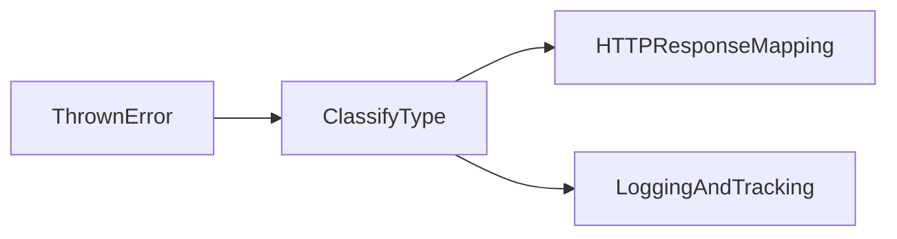

# Lesson 2: Error Types

## Learning Objectives

By the end of this lesson, you will be able to:
- Identify common JavaScript error types and what they usually indicate
- Create custom error classes for predictable error handling
- Use a base `AppError` to carry status codes and “operational” flags
- Understand why custom errors improve API responses and logging
- Avoid common pitfalls (throwing strings, losing stack traces, inconsistent error shapes)

## Why Error Types Matter

If every error is just `new Error("something")`, your system can’t reliably:
- map errors to HTTP status codes
- decide what to log vs what to show to users
- group and analyze errors in monitoring tools

Typed/custom errors make failures predictable and easier to handle.



## JavaScript Error Types

```typescript
// Error
throw new Error('Something went wrong');

// TypeError
throw new TypeError('Invalid type');

// ReferenceError
throw new ReferenceError('Variable not defined');

// Custom Error
class ValidationError extends Error {
  constructor(message: string, public field: string) {
    super(message);
    this.name = 'ValidationError';
  }
}
```

## Custom Error Classes

```typescript
class AppError extends Error {
  constructor(
    public statusCode: number,
    message: string,
    public isOperational = true
  ) {
    super(message);
    this.name = this.constructor.name;
    Error.captureStackTrace(this, this.constructor);
  }
}

class NotFoundError extends AppError {
  constructor(message = 'Resource not found') {
    super(404, message);
  }
}
```

### What “operational” means

Operational errors are expected runtime failures you can handle safely:
- invalid input
- not found
- auth failures
- upstream timeouts

Marking them helps your error handler decide:
- return a safe message (4xx/expected)
- alert and investigate (5xx/unexpected)

## Practical Mapping to HTTP Status Codes

A common mapping:
- `ValidationError` → 400
- `NotFoundError` → 404
- `UnauthorizedError` → 401
- `ForbiddenError` → 403

Keeping this mapping centralized prevents inconsistent API behavior.

## Real-World Scenario: Input Validation

When a user submits a bad email:
- you want a 400 with a clear message
- you don’t want a 500 that looks like a server bug

Custom errors let you surface the right response and still log context for debugging.

## Best Practices

### 1) Throw errors, not strings

Throwing strings loses stack traces and breaks tooling.

### 2) Use a base error type for your app

A single `AppError` makes response formatting and logging consistent.

### 3) Preserve stack traces

Use `Error.captureStackTrace` (Node) to keep the stack relevant.

## Common Pitfalls and Solutions

### Pitfall 1: Inconsistent error response shapes

**Problem:** each route formats errors differently.

**Solution:** centralize error mapping + response formatting in middleware.

### Pitfall 2: Losing the original error context

**Problem:** you wrap errors without keeping the cause.

**Solution:** include `cause` or preserve original error details in logs (not necessarily in client responses).

### Pitfall 3: Treating everything as 500

**Problem:** expected errors look like outages.

**Solution:** use operational error types and map to correct status codes.

## Troubleshooting

### Issue: Monitoring shows “too many unique errors”

**Symptoms:**
- error tracking tool groups the same issue into many different events

**Solutions:**
1. Standardize error messages/codes for expected failures.
2. Use error classes and stable error codes for grouping.

## Next Steps

Now that you can classify errors:

1. ✅ **Practice**: Create `ValidationError`, `NotFoundError`, and `UnauthorizedError`
2. ✅ **Experiment**: Add a `code` field to errors for stable client-side handling
3. 📖 **Next Lesson**: Learn about [Error Handling Patterns](./lesson-03-error-handling-patterns.md)
4. 💻 **Complete Exercises**: Work through [Exercises 01](./exercises-01.md)

## Additional Resources

- [MDN: Error Types](https://developer.mozilla.org/en-US/docs/Web/JavaScript/Reference/Global_Objects/Error)

---

**Key Takeaways:**
- Built-in error types often hint at root cause (TypeError/ReferenceError).
- Custom errors enable consistent HTTP mapping and better observability.
- Preserve stack traces and avoid throwing non-Error values.
