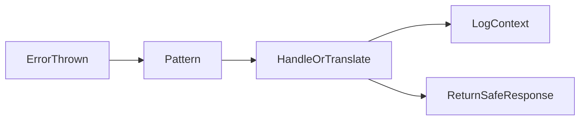

# Lesson 3: Error Handling Patterns

## Learning Objectives

By the end of this lesson, you will be able to:
- Use try/catch effectively for synchronous and async/await code
- Handle promise errors with `.catch()` and understand trade-offs
- Propagate errors safely (log context, rethrow or translate)
- Wrap external errors to provide stable error messages and status codes
- Avoid common pitfalls (double-logging, swallowing errors, losing root cause)

## Why Patterns Matter

Error handling is most effective when it is consistent.
Patterns help you:
- avoid copy/paste error chaos across files
- enforce the same response/logging approach everywhere
- keep failures observable and debuggable



## Try-Catch

```typescript
try {
  const result = riskyOperation();
} catch (error) {
  console.error('Error:', error);
  // Handle error
}
```

## Async Error Handling

```typescript
// Promise
asyncFunction()
  .then(result => {
    // Success
  })
  .catch(error => {
    // Error
  });

// Async/Await
try {
  const result = await asyncFunction();
} catch (error) {
  // Error
}
```

## Error Propagation

```typescript
async function processData(data: Data) {
  try {
    return await transform(data);
  } catch (error) {
    // Log and rethrow
    logger.error('Processing failed', { error, data });
    throw error;
  }
}
```

## Error Wrapping

```typescript
try {
  await externalService.call();
} catch (error) {
  throw new AppError(500, 'External service failed', { originalError: error });
}
```

## Patterns in Practice (What to Choose When)

### Use try/catch with async/await

`async/await` plus try/catch is often the clearest style because:
- control flow is linear
- stack traces are usually easier to follow

### Use `.catch()` when composing promises

Promise chains can be fine, but can become harder to read in complex flows.

Prefer consistency across a codebase: pick a style and stick to it.

## Error Translation vs Propagation

Two common decisions at boundaries:

- **translate**: convert low-level errors into user-safe errors (e.g., convert DB “not found” into `NotFoundError`)
- **propagate**: rethrow and let a centralized handler format the response (common in Express middleware)

## Real-World Scenario: External API Failure

If a third-party service fails:
- you want a stable internal error message (“Payments provider unavailable”)
- you want full details in logs/monitoring (original error)
- you want a safe response to clients (no secrets or raw stack)

Wrapping supports this separation.

## Best Practices

### 1) Log context at the boundary, not everywhere

Avoid double-logging:
- log once with rich context (request id, endpoint, user id)
- let errors bubble up

### 2) Preserve the root cause

Keep original error details in logs (or attach as `cause`) so debugging is possible.

### 3) Use centralized handling for HTTP APIs

Centralized middleware can:
- map error types to status codes
- enforce consistent error response shape
- hide stack traces in production

## Common Pitfalls and Solutions

### Pitfall 1: Swallowing errors

**Problem:** catching without handling or rethrowing hides failures.

**Solution:** either handle fully or rethrow after adding context.

### Pitfall 2: Double logging

**Problem:** logs spammed with the same error at multiple levels.

**Solution:** decide where logging belongs (often at the edge: request handler/middleware).

### Pitfall 3: Losing original error details

**Problem:** wrapping errors without preserving cause removes debugging signal.

**Solution:** keep `cause` (or log `originalError`) and include correlation IDs.

## Troubleshooting

### Issue: You see “500 Internal Server Error” but no useful logs

**Symptoms:**
- users report failures, logs are empty or generic

**Solutions:**
1. Ensure errors are logged with context (request id, route, user).
2. Ensure unhandled promise rejections are captured and reported.
3. Add centralized error middleware and error tracking.

## Next Steps

Now that you know common patterns:

1. ✅ **Practice**: Refactor one feature to use centralized error handling
2. ✅ **Experiment**: Introduce custom errors and map them to status codes consistently
3. 📖 **Next Level**: Move into logging concepts and structured logs
4. 💻 **Complete Exercises**: Work through [Exercises 01](./exercises-01.md)

## Additional Resources

- [Node.js: Error handling best practices](https://nodejs.org/en/learn)

---

**Key Takeaways:**
- Use try/catch for `async/await` and handle promise rejections explicitly.
- Translate errors at boundaries or propagate them to centralized handlers.
- Log once with context, preserve root causes, and keep client responses safe.
