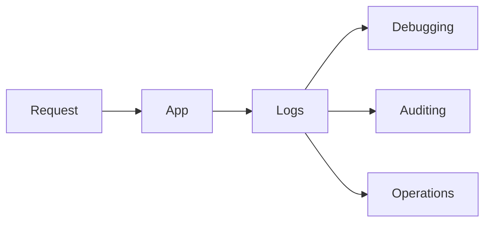

# Lesson 1: Logging Concepts

## Learning Objectives

By the end of this lesson, you will be able to:
- Explain why logging is essential for operating production systems
- Differentiate logs vs metrics vs traces (and when to use each)
- Use structured logging to add searchable context
- Understand common log formats and trade-offs (JSON vs text)
- Avoid common pitfalls (logging secrets, noisy logs, missing correlation IDs)

## Why Logging Matters

Logging is how you answer “what happened?” in production.

When something breaks, logs help you:
- identify the failing path
- correlate a single request across services
- understand the inputs and context around a failure



## Why Logging?

- **Debugging**: understand application behavior
- **Monitoring**: track application health
- **Auditing**: record important events
- **Troubleshooting**: diagnose production issues

## Logs vs Metrics vs Traces (Quick Mental Model)

- **Logs**: detailed events (“what happened?”) with context
- **Metrics**: numbers over time (“how often/how bad?”) like latency and error rate
- **Traces**: request journey across services (“where time went?”)

They work best together: metrics alert you, logs/traces explain why.

## Log Levels

- **Error**: error events (user impact or unexpected failures)
- **Warn**: suspicious or degraded behavior
- **Info**: normal business events (requests, state changes)
- **Debug**: detailed developer diagnostics
- **Verbose**: extremely detailed data (rare in production)

## Structured Logging

```typescript
logger.info("User logged in", {
  userId: user.id,
  email: user.email,
  timestamp: new Date().toISOString(),
});
```

### Why structured logs win in production

Structured logs (objects/JSON) are easier to:
- filter (by `userId`, `route`, `requestId`)
- aggregate into dashboards
- correlate across services

## Log Formats

- **JSON**: machine-readable, structured (recommended for production)
- **Text**: human-readable, simple (nice for local dev)
- **Combined**: both formats, depending on environment/transports

## Real-World Scenario: Debugging a 500 Spike

When error rate spikes:
- metrics tell you it’s happening
- logs tell you which endpoint and what error
- traces (if available) tell you where time was spent

## Best Practices

### 1) Always include correlation context

Include fields like:
- request id / correlation id
- route and status code
- user id (when available)

### 2) Never log secrets

Don’t log:
- passwords
- tokens
- session cookies

Mask or omit sensitive fields.

### 3) Keep logs actionable

Avoid noise that hides important events—use levels and consistent event naming.

## Common Pitfalls and Solutions

### Pitfall 1: Logging too little

**Problem:** errors happen but logs don’t include context.

**Solution:** add structured fields and include stack traces for server logs.

### Pitfall 2: Logging too much

**Problem:** high volume increases cost and makes debugging harder.

**Solution:** use log levels, sampling, and focus on meaningful events.

### Pitfall 3: No request IDs

**Problem:** impossible to trace a single request across logs.

**Solution:** generate a request ID per request and include it in every log line.

## Troubleshooting

### Issue: Logs are hard to search in production

**Symptoms:**
- inconsistent fields and free-text logs

**Solutions:**
1. Use JSON structured logs.
2. Standardize fields (`requestId`, `userId`, `route`, `statusCode`).
3. Centralize logs in a log platform.

## Next Steps

Now that you understand logging fundamentals:

1. ✅ **Practice**: Add structured logs to one endpoint with a request ID
2. ✅ **Experiment**: Compare JSON logs vs text logs locally
3. 📖 **Next Lesson**: Learn about [Winston Setup](./lesson-02-winston-setup.md)
4. 💻 **Complete Exercises**: Work through [Exercises 02](./exercises-02.md)

## Additional Resources

- [OWASP: Logging Cheat Sheet](https://cheatsheetseries.owasp.org/cheatsheets/Logging_Cheat_Sheet.html)

---

**Key Takeaways:**
- Logging is essential for debugging and operating production systems.
- Logs + metrics + traces work together: alert with metrics, diagnose with logs/traces.
- Prefer structured logs with correlation IDs and never log secrets.
