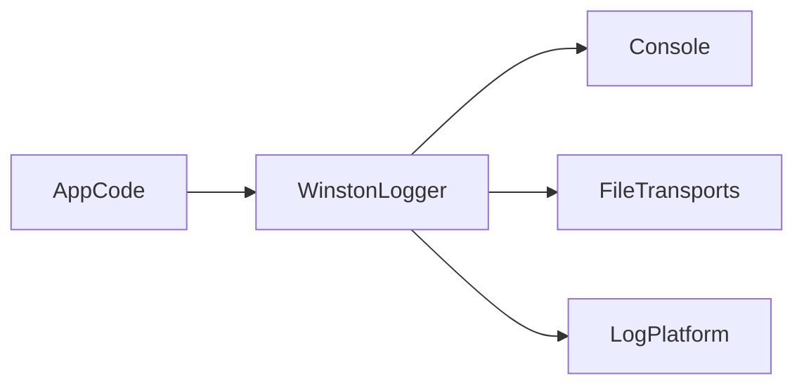

# Lesson 2: Winston Setup

## Learning Objectives

By the end of this lesson, you will be able to:
- Set up a Winston logger with sensible defaults for dev and production
- Emit structured JSON logs with timestamps and stack traces
- Configure transports (console vs files) intentionally
- Use log levels consistently across a Node app
- Avoid common pitfalls (logging secrets, inconsistent formats, missing error stacks)

## Why Winston Matters

Winston is a flexible logging library that supports:
- multiple outputs (“transports”)
- formats (JSON, text)
- log levels

The goal is to produce logs that are:
- useful for developers locally
- searchable and consistent in production



## Basic Setup (JSON + Files + Console)

```typescript
import winston from "winston";

const logger = winston.createLogger({
  level: "info",
  format: winston.format.json(),
  transports: [
    new winston.transports.File({ filename: "error.log", level: "error" }),
    new winston.transports.File({ filename: "combined.log" }),
  ],
});

if (process.env.NODE_ENV !== "production") {
  logger.add(
    new winston.transports.Console({
      format: winston.format.simple(),
    })
  );
}
```

### Practical note on file transports

In containerized deployments, writing logs to files inside the container is often not ideal.
Most teams log to stdout/stderr and let the platform collect logs.

For learning and local environments, file transports can still be useful.

## Custom Format (Timestamp + Stack + JSON)

```typescript
import winston from "winston";

const logger = winston.createLogger({
  format: winston.format.combine(
    winston.format.timestamp(),
    winston.format.errors({ stack: true }),
    winston.format.json()
  ),
  transports: [new winston.transports.Console()],
});
```

### Why `errors({ stack: true })` matters

It ensures stack traces are captured in logs when you pass an Error object.
Without this, you often lose the most important debugging information.

## Using the Logger

```typescript
logger.error("Error message", { error, context });
logger.warn("Warning message");
logger.info("Info message", { data });
logger.debug("Debug message");
```

### Logging errors safely

When logging errors:
- include stack traces server-side
- include request/context fields (requestId, route, userId)
- avoid including secrets in `context`

## Real-World Scenario: Debugging “Unhandled Error”

If a route starts returning 500s:
- `logger.error` with a stack trace and request context helps you pinpoint where it failed
- consistent JSON logs make it easy to filter affected routes/users

## Best Practices

### 1) Standardize the logger in one module

Export one logger instance and reuse it everywhere.

### 2) Prefer JSON logs in production

Human-readable logs are nice locally; production needs structured searchability.

### 3) Control log levels via env vars

Use `LOG_LEVEL` and `NODE_ENV` to avoid noisy production logs.

## Common Pitfalls and Solutions

### Pitfall 1: Missing stack traces

**Problem:** logs show messages but not where failures happened.

**Solution:** use `format.errors({ stack: true })` and pass real Error objects.

### Pitfall 2: Logging secrets

**Problem:** tokens/passwords appear in logs.

**Solution:** sanitize/omit sensitive fields and avoid logging raw headers/bodies.

### Pitfall 3: Multiple logger instances with different formats

**Problem:** inconsistent logs across files/services.

**Solution:** centralize logger creation and export a single logger.

## Troubleshooting

### Issue: Logs aren’t showing up in production

**Symptoms:**
- no logs visible in log platform

**Solutions:**
1. Ensure logs are written to stdout/stderr (console transport) in production.
2. Confirm container/platform log collection is enabled.
3. Verify log level isn’t too high (`error` only).

## Next Steps

Now that you can configure Winston:

1. ✅ **Practice**: Add request context fields (requestId/route) to logs
2. ✅ **Experiment**: Switch formats by environment (pretty dev, JSON prod)
3. 📖 **Next Lesson**: Learn about [Log Levels](./lesson-03-log-levels.md)
4. 💻 **Complete Exercises**: Work through [Exercises 02](./exercises-02.md)

## Additional Resources

- [Winston GitHub](https://github.com/winstonjs/winston)

---

**Key Takeaways:**
- Winston supports formats and transports; aim for JSON logs with timestamps and stacks.
- Centralize logger setup and reuse one instance.
- Never log secrets; include request context to make logs actionable.
