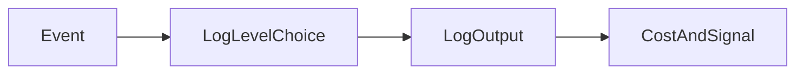

# Lesson 3: Log Levels

## Learning Objectives

By the end of this lesson, you will be able to:
- Choose appropriate log levels for events (error/warn/info/debug)
- Configure log levels via environment variables
- Understand the cost and risk of overly verbose logging in production
- Use log levels to control noise and improve signal during incidents
- Avoid common pitfalls (logging everything as error, missing warnings, debug logs in prod)

## Why Log Levels Matter

Log levels let you control:
- how much data you emit
- how easy it is to find real incidents
- how expensive logging becomes (storage + ingestion)

Log levels are not just aesthetics—they’re operational controls.



## Setting Log Level

```typescript
const logger = winston.createLogger({
  level: process.env.LOG_LEVEL || 'info'
});
```

## Environment-Based Levels

```typescript
const level = process.env.NODE_ENV === 'production' ? 'warn' : 'debug';

const logger = winston.createLogger({
  level,
  // ...
});
```

## Conditional Logging

```typescript
if (logger.level === 'debug') {
  logger.debug('Detailed debug information');
}
```

## Log Level Best Practices

- **Production**: `warn` or `error`
- **Development**: `debug` or `info`
- **Staging**: `info`
- Use environment variables to control

## Practical Guidance (What Goes Where)

- **error**: failures that affect users or indicate bugs/outages (5xx, unhandled exceptions)
- **warn**: unusual states that may become errors (retries, degraded dependencies, validation issues at high rate)
- **info**: normal business events (startup, request completed summaries, key domain actions)
- **debug**: detailed diagnostics (payload shapes, intermediate values) – usually off in production

## Real-World Scenario: Incident Response

During an incident you often:
1. increase logging detail temporarily (`LOG_LEVEL=debug`)
2. reproduce or capture failing requests
3. revert to a safer level to reduce cost/noise

This is only possible if your code uses levels correctly.

## Best Practices

### 1) Don’t log everything as error

If all logs are “error”, you can’t distinguish real incidents from normal warnings.

### 2) Keep production logs focused

Use `info`/`warn`/`error` appropriately, and avoid very verbose debug logs by default.

### 3) Use structured fields, not just messages

If you need details, include structured fields behind the right level instead of dumping raw objects always.

## Common Pitfalls and Solutions

### Pitfall 1: Debug logs in production

**Problem:** high cost, potential secret leakage, noisy logs.

**Solution:** default to `info`/`warn` in prod and use short-lived debug increases only when needed.

### Pitfall 2: Logging everything as error

**Problem:** alert fatigue and poor signal.

**Solution:** reserve error for truly exceptional conditions.

### Pitfall 3: Missing warnings for degraded behavior

**Problem:** you miss early signals (retries, slow dependencies) until outage happens.

**Solution:** log warnings for degraded states and alert on rates/thresholds.

## Troubleshooting

### Issue: You can’t see logs you expect

**Symptoms:**
- debug logs missing

**Solutions:**
1. Check `LOG_LEVEL` and environment-based config.
2. Ensure your logger configuration doesn’t override levels per transport.

## Next Steps

Now that you understand log levels:

1. ✅ **Practice**: Reclassify logs in a feature (error vs warn vs info)
2. ✅ **Experiment**: Use `LOG_LEVEL` to increase detail during a test incident
3. 📖 **Next Level**: Move into backend error handling and structured logs
4. 💻 **Complete Exercises**: Work through [Exercises 02](./exercises-02.md)

## Additional Resources

- [Winston: Logging levels](https://github.com/winstonjs/winston#logging-levels)

---

**Key Takeaways:**
- Log levels control noise, cost, and incident response effectiveness.
- Use env vars to tune verbosity per environment.
- Reserve `error` for true failures; use `warn` for degradation and `info` for normal events.
