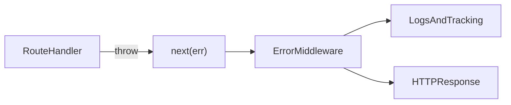

# Lesson 1: Express Error Middleware

## Learning Objectives

By the end of this lesson, you will be able to:
- Explain why centralized error middleware is critical in Express apps
- Implement an Express error-handling middleware safely
- Capture useful context in logs without leaking secrets
- Handle async route errors consistently (async wrapper pattern)
- Return consistent, safe error responses across endpoints

## Why Centralized Error Middleware Matters

Without centralized error handling:
- each route invents its own error response
- errors are inconsistently logged (or not logged at all)
- production debugging becomes much harder

Central error middleware gives you:
- one place to format responses
- one place to log and track errors
- consistent behavior across the API



## Error Middleware (Basic Pattern)

```typescript
app.use((err: Error, req: Request, res: Response, next: NextFunction) => {
  logger.error("Error:", {
    error: err.message,
    stack: err.stack,
    path: req.path,
    method: req.method,
  });

  res.status(500).json({
    success: false,
    error: "Internal server error",
  });
});
```

### What to log (and what not to log)

Log:
- request id
- route/method
- user id (if available)
- error stack

Avoid logging:
- passwords/tokens
- full request bodies containing sensitive data

## Async Error Wrapper (Avoiding Unhandled Rejections)

Express won’t automatically catch promise rejections in async handlers unless you pass errors to `next`.
A wrapper makes this consistent:

```typescript
function asyncHandler(fn: Function) {
  return (req: Request, res: Response, next: NextFunction) => {
    Promise.resolve(fn(req, res, next)).catch(next);
  };
}

// Usage
app.get(
  "/users/:id",
  asyncHandler(async (req, res) => {
    const user = await getUser(req.params.id);
    res.json(user);
  })
);
```

## Consistent Error Response Format

Centralize response formatting so clients always get the same shape:

```typescript
interface ErrorResponse {
  success: false;
  error: string;
  details?: unknown;
}

function sendError(
  res: Response,
  error: string,
  status = 500,
  details?: unknown
) {
  const body: ErrorResponse = {
    success: false,
    error,
    ...(details !== undefined ? { details } : {}),
  };

  res.status(status).json(body);
}
```

### Development vs production

In production:
- avoid returning stack traces to clients
In development:
- you can include stack traces to speed up debugging (but keep it consistent and controlled)

## Real-World Scenario: Validation Errors vs Server Errors

A good API makes it obvious:
- 400: client input is invalid
- 401/403: auth issues
- 404: missing resource
- 500: server error

Error middleware helps enforce these consistently across routes.

## Best Practices

### 1) Handle errors in one place

Throw (or `next(err)`) in route handlers, format responses in middleware.

### 2) Preserve root cause for logs/monitoring

Log stack traces and include stable context (route, requestId).

### 3) Avoid double-logging

Log once at the boundary (error middleware) with all context.

## Common Pitfalls and Solutions

### Pitfall 1: Async errors crash the process or become unhandled rejections

**Problem:** async handlers throw but Express doesn’t catch them.

**Solution:** use async wrappers (or a framework that handles async errors).

### Pitfall 2: Leaking sensitive data in error responses

**Problem:** stack traces or DB errors returned to clients.

**Solution:** return safe messages and keep details in logs/error tracking.

### Pitfall 3: Inconsistent error response shapes

**Problem:** frontend has to handle many formats.

**Solution:** centralize response formatting and enforce it everywhere.

## Troubleshooting

### Issue: Errors don’t reach the error middleware

**Symptoms:**
- server crashes or returns HTML error pages

**Solutions:**
1. Ensure your error middleware is registered after routes.
2. Ensure async errors call `next(err)` via wrapper.
3. Ensure you don’t `try/catch` and swallow errors in route handlers.

## Next Steps

Now that you can centralize backend errors:

1. ✅ **Practice**: Add async wrapper to all async routes
2. ✅ **Experiment**: Add request IDs and log them in error middleware
3. 📖 **Next Lesson**: Learn about [Error Responses](./lesson-02-error-responses.md)
4. 💻 **Complete Exercises**: Work through [Exercises 03](./exercises-03.md)

## Additional Resources

- [Express: Error handling](https://expressjs.com/en/guide/error-handling.html)

---

**Key Takeaways:**
- Central error middleware gives consistent responses and consistent logs.
- Async handlers need a wrapper (or equivalent) so errors reach middleware.
- Log context safely; never leak secrets or stack traces to clients in production.
