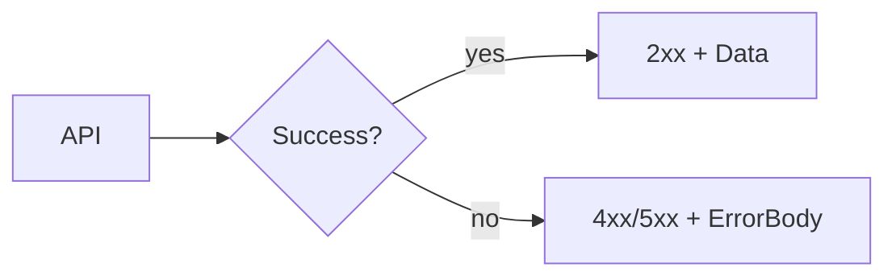

# Lesson 2: Error Responses

## Learning Objectives

By the end of this lesson, you will be able to:
- Define a consistent error response format for an API
- Map error types to correct HTTP status codes
- Include safe details for client UX without leaking internals
- Implement centralized error response mapping in middleware
- Avoid common pitfalls (200-with-error-body, inconsistent shapes, stack traces in production)

## Why Error Responses Matter

When an API fails, clients need to know:
- did it fail due to invalid input?
- is auth required?
- is the resource missing?
- is this a server failure?

Consistent responses make frontend error handling predictable and reduce special-case logic.



## Consistent Error Format

```typescript
class ApiError extends Error {
  constructor(
    public statusCode: number,
    message: string,
    public details?: any
  ) {
    super(message);
  }
  
  toJSON() {
    return {
      success: false,
      error: this.message,
      ...(this.details && { details: this.details })
    };
  }
}
```

### What to put in `details`

Good candidates:
- field validation issues
- stable error codes (e.g., `USER_NOT_FOUND`)

Avoid:
- stack traces
- raw SQL/DB errors in production

## Status Code Mapping

```typescript
function getStatusCode(error: Error): number {
  if (error instanceof ValidationError) return 400;
  if (error instanceof NotFoundError) return 404;
  if (error instanceof UnauthorizedError) return 401;
  return 500;
}
```

## Error Middleware (Centralized Formatting)

```typescript
app.use((err: Error, req: Request, res: Response, next: NextFunction) => {
  const statusCode = err instanceof ApiError ? err.statusCode : 500;
  
  res.status(statusCode).json({
    success: false,
    error: err.message,
    ...(process.env.NODE_ENV === 'development' && { stack: err.stack })
  });
});
```

### Production note

Returning stack traces is useful in development but unsafe in production.
Keep stacks in logs/error tracking, not in client responses.

## Real-World Scenario: Frontend Form Validation

If a signup form fails validation:
- backend returns 400
- body includes `details` for which fields failed
- frontend renders inline errors without guessing

## Best Practices

### 1) Use correct status codes

Status codes are semantics; clients and monitoring rely on them.

### 2) Keep messages user-safe

Return safe messages; log internals separately.

### 3) Standardize across endpoints

Use middleware/helpers so every endpoint matches the same contract.

## Common Pitfalls and Solutions

### Pitfall 1: Returning 200 with error body

**Problem:** clients treat failures as success.

**Solution:** return 4xx/5xx codes appropriately.

### Pitfall 2: Inconsistent error shapes

**Problem:** frontend must handle multiple formats.

**Solution:** enforce one error response shape everywhere.

### Pitfall 3: Leaking internals

**Problem:** stack traces and DB errors exposed to clients.

**Solution:** keep details in logs/error tracking; return safe messages to clients.

## Troubleshooting

### Issue: Clients can’t differentiate error types

**Symptoms:**
- all failures look identical

**Solutions:**
1. Use correct status codes.
2. Add stable error codes in `details` for expected failures.

## Next Steps

Now that you can return consistent errors:

1. ✅ **Practice**: Add 400/401/403/404/409 responses in your API
2. ✅ **Experiment**: Add stable error codes for client-side handling
3. 📖 **Next Lesson**: Learn about [Structured Logging](./lesson-03-structured-logging.md)
4. 💻 **Complete Exercises**: Work through [Exercises 03](./exercises-03.md)

## Additional Resources

- [MDN: HTTP status codes](https://developer.mozilla.org/en-US/docs/Web/HTTP/Status)

---

**Key Takeaways:**
- Consistent error shapes and correct status codes make APIs easier to consume.
- Include structured details for UX, but never leak internals in production.
- Centralize formatting in middleware to keep behavior consistent.
