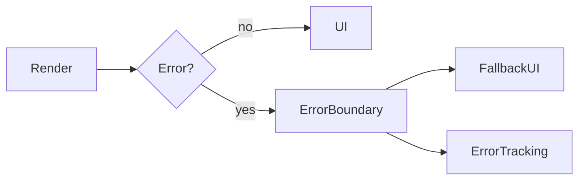

# Lesson 1: React Error Boundaries

## Learning Objectives

By the end of this lesson, you will be able to:
- Explain what React error boundaries do (and what they don’t catch)
- Implement an error boundary to prevent full-app UI crashes
- Capture errors for logging/error tracking from the frontend
- Design user-friendly fallback UI for unexpected crashes
- Avoid common pitfalls (assuming boundaries catch async errors, leaking details, unusable fallback screens)

## Why Error Boundaries Matter

In a frontend app, an uncaught render error can crash the entire UI.
Error boundaries provide a “safety net” so:
- the rest of the app can keep functioning
- users see a friendly fallback instead of a blank page
- developers get error reports with context



## What Error Boundaries Catch (Important)

Error boundaries catch errors during:
- rendering
- lifecycle methods
- constructors of child components

They do **not** catch:
- errors in event handlers (you must handle those)
- errors in async code (promises, `setTimeout`)
- errors in server components on the server (framework-specific)

## Error Boundary Component (Class Component)

```typescript
"use client";

import React from "react";

class ErrorBoundary extends React.Component<
  { children: React.ReactNode },
  { hasError: boolean }
> {
  constructor(props: { children: React.ReactNode }) {
    super(props);
    this.state = { hasError: false };
  }

  static getDerivedStateFromError(_error: Error) {
    return { hasError: true };
  }

  componentDidCatch(error: Error, errorInfo: React.ErrorInfo) {
    console.error("Error caught by boundary:", error, errorInfo);
    // Send to error tracking service (Sentry, etc.)
  }

  render() {
    if (this.state.hasError) {
      return <div>Something went wrong</div>;
    }

    return this.props.children;
  }
}
```

### What makes the fallback “good”

A good fallback:
- tells the user what to do next (refresh, go back)
- preserves navigation when possible
- does not expose sensitive details

## Using Error Boundary

```typescript
<ErrorBoundary>
  <App />
</ErrorBoundary>
```

### Where to place boundaries

Common placement strategies:
- one “global” boundary near the app root
- additional boundaries around risky parts (complex widgets, routes)

## Real-World Scenario: Third-Party Component Crash

A third-party chart library might crash on unexpected input.
A local error boundary around the chart:
- prevents the entire page from crashing
- shows a targeted fallback (“Chart failed to load”)
- captures the error for debugging

## Best Practices

### 1) Use boundaries for unexpected crashes

Don’t use boundaries as control flow for expected errors (like validation).

### 2) Capture errors to tracking

Console logs help locally; production needs error tracking (Sentry).

### 3) Keep fallback UI helpful

Give users actions: retry, refresh, navigate to a safe page.

## Common Pitfalls and Solutions

### Pitfall 1: Assuming boundaries catch async errors

**Problem:** promise rejects, but boundary doesn’t catch it.

**Solution:** handle async errors in the async flow and report them separately.

### Pitfall 2: Fallback UI is a dead end

**Problem:** user is stuck with no recovery path.

**Solution:** add a retry button, navigation, and/or reload option.

### Pitfall 3: Leaking error details

**Problem:** showing stack traces in production.

**Solution:** show safe messages to users; keep details in tracking tools.

## Troubleshooting

### Issue: App still “white screens” on errors

**Symptoms:**
- entire UI disappears

**Solutions:**
1. Ensure the error boundary wraps the crashing component subtree.
2. Confirm the crash is a render/lifecycle error (not an async/event error).

## Next Steps

Now that you can prevent UI crashes:

1. ✅ **Practice**: Add a boundary around a risky UI widget
2. ✅ **Experiment**: Report `componentDidCatch` errors to an error tracking service
3. 📖 **Next Lesson**: Learn about [Error Handling Hooks](./lesson-02-error-handling-hooks.md)
4. 💻 **Complete Exercises**: Work through [Exercises 04](./exercises-04.md)

## Additional Resources

- [React Docs: Error Boundaries](https://react.dev/reference/react/Component#catching-rendering-errors-with-an-error-boundary)

---

**Key Takeaways:**
- Error boundaries prevent render-time crashes from taking down your entire UI.
- They don’t catch async/event errors—handle those separately.
- Provide user-friendly fallbacks and report crashes to error tracking in production.
