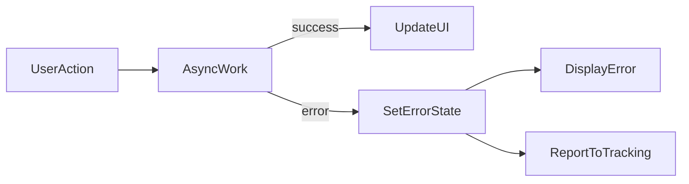

# Lesson 2: Error Handling Hooks

## Learning Objectives

By the end of this lesson, you will be able to:
- Build reusable hooks for handling UI errors and async failures
- Track loading/error state for async actions consistently
- Decide when to show inline errors vs global banners
- Report errors to an error tracking system without crashing the UI
- Avoid common pitfalls (swallowing errors, infinite retries, exposing dev details in prod)

## Why Hooks Matter for Error Handling

Most frontend errors aren’t render-time crashes:
- fetch failures
- validation failures
- timeouts
- permission errors

Hooks help you standardize:
- error state management
- reporting to tracking tools
- consistent UX patterns (toast, banner, inline)



## Custom Error Hook (Local Error State)

```typescript
"use client";

import { useState, useCallback } from "react";

function useErrorHandler() {
  const [error, setError] = useState<Error | null>(null);

  const handleError = useCallback((error: Error) => {
    setError(error);
    // Send to error tracking
    console.error("Error:", error);
  }, []);

  const clearError = useCallback(() => {
    setError(null);
  }, []);

  return { error, handleError, clearError };
}
```

### UX tip

Use this for “local” errors:
- a single form
- a single widget

Don’t show global error banners for tiny local failures.

## Async Error Handling Hook

```typescript
import { useState, useCallback } from "react";

function useAsync<T>() {
  const [loading, setLoading] = useState(false);
  const [error, setError] = useState<Error | null>(null);

  const execute = useCallback(async (asyncFn: () => Promise<T>) => {
    try {
      setLoading(true);
      setError(null);
      return await asyncFn();
    } catch (err) {
      setError(err as Error);
      throw err;
    } finally {
      setLoading(false);
    }
  }, []);

  return { execute, loading, error };
}
```

### Why rethrow

Rethrowing allows callers to:
- handle control flow (e.g., stop navigation)
- run additional cleanup

But you should avoid double-reporting the same error in multiple places.

## Real-World Scenario: Fetch + Retry

If `GET /profile` fails due to network:
- show a retry button
- keep the UI responsive
- report the failure (with request id if available)

Hooks make this behavior consistent across pages.

## Best Practices

### 1) Don’t treat expected errors as “crashes”

Validation and 401/403 errors are expected outcomes—handle them as UX states.

### 2) Report unexpected errors

Report:
- 5xx responses
- unexpected exceptions
- repeated failures that indicate a bug

### 3) Keep dev-only details gated

Only show internal details in development; never in production UI.

## Common Pitfalls and Solutions

### Pitfall 1: Swallowing errors

**Problem:** errors are caught, but neither reported nor shown.

**Solution:** set error state, show UX, and/or report to tracking.

### Pitfall 2: Infinite retries

**Problem:** retry loops hammer backend and worsen incidents.

**Solution:** limit retries and use backoff; require user action for repeated retries.

### Pitfall 3: Duplicated error reporting

**Problem:** same error is reported multiple times (noise).

**Solution:** decide where reporting happens (hook vs caller) and keep it consistent.

## Troubleshooting

### Issue: UI gets stuck in “loading”

**Symptoms:**
- spinner never stops after failure

**Solutions:**
1. Ensure `finally` resets loading state.
2. Ensure errors aren’t causing early returns that skip cleanup.

## Next Steps

Now that you can standardize async error handling:

1. ✅ **Practice**: Add a `useAsync` hook to one data-fetching page
2. ✅ **Experiment**: Implement a retry button with bounded retries/backoff
3. 📖 **Next Lesson**: Learn about [User-Friendly Errors](./lesson-03-user-friendly-errors.md)
4. 💻 **Complete Exercises**: Work through [Exercises 04](./exercises-04.md)

## Additional Resources

- [React: State and lifecycle](https://react.dev/learn)

---

**Key Takeaways:**
- Hooks help standardize async loading/error states and reporting.
- Don’t crash the UI for expected failures; handle them as UX states.
- Avoid infinite retries and duplicated reporting noise.
