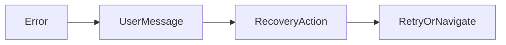

# Lesson 3: User-Friendly Errors

## Learning Objectives

By the end of this lesson, you will be able to:
- Design user-friendly error messages that guide recovery
- Render safe error UI without leaking internal details
- Map common failure categories to helpful messages (network, not-found, auth)
- Add retry mechanisms with limits and backoff
- Avoid common pitfalls (showing raw errors, blameful UX, infinite retries)

## Why User-Friendly Errors Matter

Even when your system handles errors correctly, UX can still fail if users see:
- confusing messages (“TypeError: …”)
- blameful messages (“You did something wrong”)
- no recovery path

Good error UX:
- explains what happened at the right level of detail
- suggests what to do next (retry, refresh, login)
- preserves trust and reduces support tickets



## Error Display Component (Safe by Default)

```typescript
"use client";

export default function ErrorDisplay({ error }: { error: Error | null }) {
  if (!error) return null;

  return (
    <div className="error-message" role="alert">
      <p>Something went wrong. Please try again.</p>
      {process.env.NODE_ENV === "development" && (
        <details>
          <summary>Error details</summary>
          <pre>{error.message}</pre>
        </details>
      )}
    </div>
  );
}
```

### Why we hide details in production

Raw error messages can reveal:
- internal implementation details
- sensitive information
- security-relevant hints

Keep details in logs/error tracking instead.

## Error Messages (Categorize, Don’t Parse Strings Forever)

```typescript
function getErrorMessage(error: Error): string {
  if (error.message.includes("network")) {
    return "Network error. Please check your connection.";
  }
  if (error.message.includes("404")) {
    return "Resource not found.";
  }
  return "An unexpected error occurred. Please try again.";
}
```

### Better long-term approach

Instead of string-matching messages, prefer:
- stable error codes from the backend
- typed errors in the client
- status-code based mapping (400/401/403/404/500)

## Retry Mechanism (Bounded + Backoff)

```typescript
async function fetchWithRetry(url: string, retries = 3) {
  for (let i = 0; i < retries; i++) {
    try {
      return await fetch(url);
    } catch (error) {
      if (i === retries - 1) throw error;
      await new Promise((resolve) => setTimeout(resolve, 1000 * (i + 1)));
    }
  }
}
```

### Retry best practices

- retry only transient failures (network/timeouts, 503)
- don’t retry 4xx errors like 401/403/404 by default
- add backoff and cap retries to avoid hammering the backend

## Real-World Scenario: “Save Failed” in a Form

For a save action:
- show an inline message near the form
- keep user input intact
- allow retry
- report unexpected errors to tracking

## Best Practices

### 1) Provide a recovery path

Give users actions:
- retry
- refresh
- contact support (for critical flows)

### 2) Use empathetic, clear language

Avoid blame. Keep messages short and actionable.

### 3) Separate UX errors from diagnostics

Users should see safe summaries; developers need stack traces and breadcrumbs in tracking.

## Common Pitfalls and Solutions

### Pitfall 1: Showing raw error messages

**Problem:** confusing and potentially unsafe.

**Solution:** map to friendly messages and gate details to development only.

### Pitfall 2: Infinite retries

**Problem:** backend gets hammered and user experience worsens.

**Solution:** cap retries and require user action after failures.

### Pitfall 3: Treating auth errors like generic failures

**Problem:** user sees “try again” when they actually need to log in.

**Solution:** map 401/403 to “please sign in” / “insufficient permissions” with navigation.

## Troubleshooting

### Issue: Users report errors but you can’t diagnose

**Symptoms:**
- UI shows generic message with no tracking

**Solutions:**
1. Report unexpected errors to error tracking.
2. Add correlation IDs (requestId) and include them in API responses/logs.
3. Add breadcrumbs (route, action name) in tracking events.

## Next Steps

Now that you can design user-friendly errors:

1. ✅ **Practice**: Add error UI states to one page (loading/error/success)
2. ✅ **Experiment**: Implement retry with backoff for network failures only
3. 📖 **Next Level**: Move into Sentry integration and production monitoring/alerting
4. 💻 **Complete Exercises**: Work through [Exercises 04](./exercises-04.md)

## Additional Resources

- [NN/g: Error messages](https://www.nngroup.com/articles/error-message-guidelines/)

---

**Key Takeaways:**
- User-friendly errors are clear, safe, and actionable.
- Don’t leak internal details in production UI; keep diagnostics in tracking/logs.
- Retries should be bounded and used only for transient failures.
