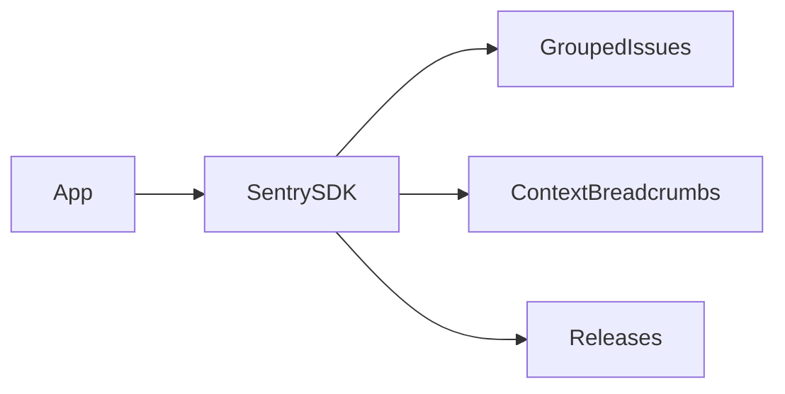

# Lesson 1: Sentry Setup

## Learning Objectives

By the end of this lesson, you will be able to:
- Explain what Sentry provides (error tracking + performance monitoring)
- Set up Sentry on backend and frontend safely using environment variables
- Understand where Sentry middleware belongs in an Express app
- Configure sampling intentionally (avoid `1.0` everywhere in production)
- Avoid common pitfalls (leaking PII, misplacing middleware, noisy projects)

## Why Sentry Matters

Logs tell you “what happened”, but error tracking helps you answer:
- what stack trace occurred?
- how often?
- which users are affected?
- what happened leading up to the error (breadcrumbs)?

Sentry gives you:
- grouped errors (issues)
- stack traces + context
- release tracking (what deploy introduced an issue)



## Backend Setup (Node)

```typescript
import * as Sentry from "@sentry/node";

Sentry.init({
  dsn: process.env.SENTRY_DSN,
  environment: process.env.NODE_ENV,
  tracesSampleRate: 1.0,
});
```

### Sampling note (very important)

`tracesSampleRate: 1.0` is usually too high for production.
In production you typically start small (e.g., 0.01–0.1) and adjust based on:
- traffic volume
- cost constraints
- how much data you need

## Frontend Setup (Next.js)

```typescript
import * as Sentry from "@sentry/nextjs";

Sentry.init({
  dsn: process.env.NEXT_PUBLIC_SENTRY_DSN,
  environment: process.env.NODE_ENV,
  tracesSampleRate: 1.0,
});
```

### Why `NEXT_PUBLIC_*`

Client-side code can only read env vars prefixed for exposure.
Treat client DSNs as public configuration (not secrets).

## Express Integration (Middleware Order)

```typescript
import * as Sentry from "@sentry/node";

app.use(Sentry.Handlers.requestHandler());
app.use(Sentry.Handlers.tracingHandler());

// ... your routes

app.use(Sentry.Handlers.errorHandler());
```

### Why order matters

- request handler must run early to attach context
- error handler must run after routes to capture errors

## Real-World Scenario: “It Works Locally”

Sentry helps when errors:
- only happen in production data
- happen intermittently
- affect a small subset of users

You get stack traces, release versions, and breadcrumbs to diagnose quickly.

## Best Practices

### 1) Sanitize sensitive data

Avoid sending:
- passwords
- tokens
- full request bodies with PII

### 2) Use environments and releases

Separate:
- dev
- staging
- production

And set releases so you can correlate errors with deploys.

### 3) Tune sampling

Start low, measure value, then increase if needed.

## Common Pitfalls and Solutions

### Pitfall 1: Sentry floods with noise

**Problem:** too many low-value errors and duplicates.

**Solution:** fix top issues, add ignore rules carefully, and tune sampling.

### Pitfall 2: Middleware order incorrect

**Problem:** missing context or missing captured errors.

**Solution:** ensure request handler before routes and error handler after routes.

### Pitfall 3: Capturing sensitive data

**Problem:** PII leaks into Sentry.

**Solution:** sanitize payloads and configure SDK options to redact fields.

## Troubleshooting

### Issue: Events aren’t showing up in Sentry

**Symptoms:**
- errors happen but no Sentry issues appear

**Solutions:**
1. Confirm DSN is configured in the environment.
2. Confirm SDK initialized before errors occur.
3. Confirm network access and environment names are correct.

## Next Steps

Now that Sentry is set up:

1. ✅ **Practice**: Add environment + release tagging
2. ✅ **Experiment**: Trigger a test error and verify it appears in Sentry
3. 📖 **Next Lesson**: Learn about [Error Tracking](./lesson-02-error-tracking.md)
4. 💻 **Complete Exercises**: Work through [Exercises 05](./exercises-05.md)

## Additional Resources

- [Sentry Docs](https://docs.sentry.io/)

---

**Key Takeaways:**
- Sentry provides grouped error tracking and performance monitoring with context.
- Middleware order matters in Express.
- Sampling and data sanitization are essential for production use.
