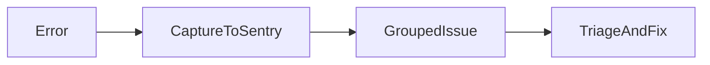

# Lesson 2: Error Tracking

## Learning Objectives

By the end of this lesson, you will be able to:
- Capture exceptions and messages in Sentry intentionally (not everything)
- Add user and request context safely (avoid PII leaks)
- Use breadcrumbs to improve debugging signal
- Decide when to rethrow vs handle errors after capturing
- Avoid common pitfalls (double-capturing, noisy events, capturing secrets)

## Why Error Tracking Matters (Beyond Logs)

Error tracking systems help you:
- group similar errors together
- track frequency and impacted users
- see stack traces with context and breadcrumbs

This reduces “hunt through logs” time during incidents.



## Capturing Errors

```typescript
try {
  riskyOperation();
} catch (error) {
  Sentry.captureException(error);
  throw error;
}
```

### When to rethrow

Rethrow when:
- the caller needs to handle the failure
- you need centralized middleware to format the response

Don’t swallow errors unless you truly handle them and can continue safely.

## Capturing Messages

Use messages for notable events (not exceptions):

```typescript
Sentry.captureMessage("Something important happened", "info");
```

Examples:
- background job started/finished
- unusual but non-fatal states

## Adding Context (User + Request)

```typescript
Sentry.setUser({ id: user.id, email: user.email });
Sentry.setContext("request", {
  method: req.method,
  path: req.path,
});
Sentry.captureException(error);
```

### Security note

Be careful with:
- email addresses
- IP addresses
- request bodies

Decide what counts as PII in your environment and sanitize/redact as needed.

## Breadcrumbs (High-Value Debugging Signal)

Breadcrumbs are a “trail” of events leading up to a crash:

```typescript
Sentry.addBreadcrumb({
  category: "auth",
  message: "User logged in",
  level: "info",
});
```

Examples:
- navigation events
- API calls
- user actions (clicked button, submitted form)

## Real-World Scenario: Debugging a Checkout Error

Without breadcrumbs:
- you see the final stack trace only

With breadcrumbs:
- you can see what actions and requests happened before the crash
- you can reproduce and fix faster

## Best Practices

### 1) Capture unexpected errors, not expected validation failures

Expected 400 errors don’t need to flood error tracking.

### 2) Add stable tags

Tag by:
- environment
- release
- route/feature area

This improves grouping and triage.

### 3) Avoid double-capturing

Capture once at the boundary (middleware, global handler) unless you need special context.

## Common Pitfalls and Solutions

### Pitfall 1: Too much noise

**Problem:** Sentry is flooded and real issues are hidden.

**Solution:** capture only unexpected failures; use sampling for high-volume categories.

### Pitfall 2: Capturing secrets/PII

**Problem:** sensitive data ends up in Sentry.

**Solution:** sanitize context, avoid logging raw bodies/headers, and redact fields.

### Pitfall 3: Double-capturing exceptions

**Problem:** the same error appears multiple times with slightly different stacks.

**Solution:** decide one capture point and keep it consistent.

## Troubleshooting

### Issue: Errors appear but have no useful context

**Symptoms:**
- stack traces missing route/user info

**Solutions:**
1. Set user/context when available.
2. Add breadcrumbs for key actions.
3. Tag errors with route/service/release.

## Next Steps

Now that you can capture meaningful errors:

1. ✅ **Practice**: Add breadcrumbs for key user actions
2. ✅ **Experiment**: Add stable tags (route, feature) for grouping
3. 📖 **Next Lesson**: Learn about [Performance Monitoring](./lesson-03-performance-monitoring.md)
4. 💻 **Complete Exercises**: Work through [Exercises 05](./exercises-05.md)

## Additional Resources

- [Sentry: Breadcrumbs](https://docs.sentry.io/platforms/javascript/guides/)

---

**Key Takeaways:**
- Capture exceptions intentionally and keep noise low.
- Add context and breadcrumbs to speed up debugging.
- Sanitize data to avoid leaking secrets/PII into tracking tools.
