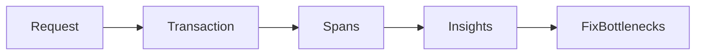

# Lesson 3: Performance Monitoring

## Learning Objectives

By the end of this lesson, you will be able to:
- Understand what Sentry performance monitoring measures (transactions, spans)
- Instrument backend requests and key operations (DB calls, external HTTP)
- Configure sampling responsibly for production
- Use performance traces to identify bottlenecks (slow routes, slow queries)
- Avoid common pitfalls (sampling too high, missing context, tracing sensitive data)

## Why Performance Monitoring Matters

Errors are only half the story. Slow systems also create “failures”:
- timeouts
- degraded UX
- higher infrastructure cost

Performance monitoring helps you answer:
- which endpoints are slow?
- where time is spent (DB, network, CPU)?
- what changed in the latest release?



## Transaction Tracking (Manual)

```typescript
const transaction = Sentry.startTransaction({
  op: "http.server",
  name: "GET /users",
});

// ... operation

transaction.finish();
```

Transactions represent a top-level unit of work (e.g., a request).

## Custom Spans (Measure Work Inside Transactions)

```typescript
const span = transaction.startChild({
  op: "db.query",
  description: "SELECT users",
});

// ... database operation

span.finish();
```

Spans help you see where time is spent inside a request:
- DB queries
- calls to external services
- expensive computations

## Automatic Instrumentation (Backend)

```typescript
Sentry.init({
  dsn: process.env.SENTRY_DSN,
  integrations: [
    new Sentry.Integrations.Http({ tracing: true }),
    new Sentry.Integrations.Express({ app }),
  ],
  tracesSampleRate: 1.0,
});
```

### Sampling note (production)

`tracesSampleRate: 1.0` can be extremely expensive in production.
Start low and adjust:
- 0.01 (1%) is a common starting point for higher-traffic services
- increase for staging or short debugging windows

## Real-World Scenario: Slow “Users List” Endpoint

You see p95 latency spike on `GET /users`.
Traces reveal:
- DB query time dominates
- one join is slow

Action:
- add index
- optimize query shape
- reduce payload size

## Best Practices

### 1) Use performance monitoring for bottlenecks, not everything

Focus on:
- critical endpoints
- slow transactions
- high-impact routes

### 2) Keep sampling controlled

Tune sampling by environment and traffic volume.

### 3) Avoid capturing sensitive payload details

Trace metadata should be useful but safe.

## Common Pitfalls and Solutions

### Pitfall 1: Sampling too high

**Problem:** cost explosion and too much data.

**Solution:** start low and only raise sampling when debugging.

### Pitfall 2: No useful span boundaries

**Problem:** you see a slow transaction but not why.

**Solution:** add spans around DB and external calls.

### Pitfall 3: Misinterpreting performance data

**Problem:** optimizing the wrong thing (micro-optimizations).

**Solution:** target the biggest contributors in the trace first.

## Troubleshooting

### Issue: No transactions appear in performance view

**Symptoms:**
- errors appear but no traces

**Solutions:**
1. Ensure tracing integration is enabled and sampling is non-zero.
2. Confirm environment/release settings are correct.
3. Ensure the app initialization happens before requests.

## Next Steps

Now that you can measure performance:

1. ✅ **Practice**: Add spans around DB calls and external HTTP calls
2. ✅ **Experiment**: Adjust sampling and compare data volume vs insight
3. 📖 **Next Level**: Move into production monitoring and alerting practices
4. 💻 **Complete Exercises**: Work through [Exercises 05](./exercises-05.md)

## Additional Resources

- [Sentry: Performance monitoring](https://docs.sentry.io/product/performance/)

---

**Key Takeaways:**
- Transactions and spans show where time is spent in real requests.
- Automatic instrumentation helps, but sampling must be tuned for production.
- Use traces to fix the biggest bottlenecks first (DB, network, payload).
