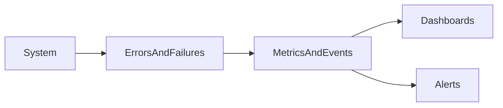

# Lesson 1: Error Monitoring

## Learning Objectives

By the end of this lesson, you will be able to:
- Identify the most important error monitoring signals (rate, volume, user impact)
- Understand how to monitor errors across API, frontend, and background jobs
- Track errors by type and by endpoint to reduce mean time to resolution (MTTR)
- Recognize early warning indicators (error spikes, latency increases, saturation)
- Avoid common pitfalls (monitoring only 500s, ignoring user impact, no correlation IDs)

## Why Error Monitoring Matters

You can’t operate what you can’t observe.

Error monitoring helps you:
- detect incidents early
- quantify impact (users affected)
- prioritize fixes (which errors matter most)



## Key Metrics (High Value)

- **Error rate**: % of requests that fail (often by route)
- **Error volume**: errors per minute (helps detect spikes)
- **Error type distribution**: validation vs auth vs server failures
- **Affected users**: how many users experienced errors (impact-based prioritization)
- **Latency correlation**: error spikes often correlate with latency spikes

### “What is normal?”

Monitoring needs baselines:
- compare error rate to historical norms
- alert on sudden changes (anomaly detection) and thresholds

## Monitoring Dashboard (Concept)

```typescript
const errorMetrics = {
  totalErrors: 0,
  errorsByType: new Map<string, number>(),
  errorsByEndpoint: new Map<string, number>(),
};

function trackError(error: Error, context: any) {
  errorMetrics.totalErrors++;
  // Update metrics by type/endpoint
  // Emit to monitoring service
}
```

### Production note

In production you typically use:
- an APM/error tracker (Sentry)
- a metrics platform (Prometheus/CloudWatch/Datadog)

In-memory counters reset on deploy and don’t scale horizontally.

## Alerting (Concept)

```typescript
function checkErrorThreshold() {
  if (errorMetrics.totalErrors > 100) {
    sendAlert("High error rate detected");
  }
}
```

### Better alert design

Prefer alerts based on:
- rate over time window (e.g., 5xx > 2% over 5 minutes)
- p95 latency + error rate combined
- user impact thresholds

## Real-World Scenario: Release Regression

After a deploy:
- error rate rises from 0.3% to 3%
- affected users increases quickly

Good monitoring helps you:
- detect it within minutes
- correlate with release version
- roll back or hotfix quickly

## Best Practices

### 1) Monitor user impact, not only error counts

One error affecting thousands of users is more urgent than many errors affecting one test account.

### 2) Break down by endpoint and error type

Global error rate hides localized failures.

### 3) Correlate errors with releases

Release tagging makes root cause analysis much faster.

## Common Pitfalls and Solutions

### Pitfall 1: Monitoring only 500s

**Problem:** you miss auth failures, rate limiting spikes, or client-visible 4xx regressions.

**Solution:** monitor key 4xx categories as well (401/403/429) when they affect UX.

### Pitfall 2: No alert ownership

**Problem:** alerts fire, nobody responds.

**Solution:** define on-call routing and escalation.

### Pitfall 3: Missing correlation IDs

**Problem:** errors are hard to trace across logs/traces.

**Solution:** include request IDs across logs, traces, and error events.

## Troubleshooting

### Issue: Alerts are noisy

**Symptoms:**
- constant alerts that don’t indicate real incidents

**Solutions:**
1. Alert on rates, not raw counts.
2. Use longer windows and require sustained thresholds.
3. Add severity tiers (warn vs page).

## Next Steps

Now that you understand monitoring signals:

1. ✅ **Practice**: Define “golden alerts” for your API (error rate + latency + saturation)
2. ✅ **Experiment**: Tag errors with release/environment and verify correlation in dashboards
3. 📖 **Next Lesson**: Learn about [Alerting](./lesson-02-alerting.md)
4. 💻 **Complete Exercises**: Work through [Exercises 06](./exercises-06.md)

## Additional Resources

- [Google SRE: Monitoring](https://sre.google/sre-book/monitoring-distributed-systems/)

---

**Key Takeaways:**
- Monitor error rate, volume, and affected users, broken down by endpoint and type.
- Alerts should be actionable, owned, and based on rates over time windows.
- Correlate errors with releases and use correlation IDs for fast debugging.
