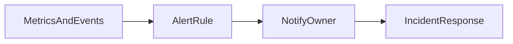

# Lesson 2: Alerting

## Learning Objectives

By the end of this lesson, you will be able to:
- Design alert conditions that reflect user impact (not just “CPU high”)
- Choose alert channels and escalation paths appropriately
- Separate warning vs paging alerts to prevent alert fatigue
- Configure alerts for specific error classes (DB down, auth failures, queue backlog)
- Avoid common pitfalls (noisy alerts, no ownership, alerting on symptoms too late)

## Why Alerting Matters

Monitoring tells you what happened; alerting tells you **when to act**.

A good alert:
- is actionable
- has an owner
- fires at the right time (not too early, not too late)



## Alert Conditions (Examples)

```typescript
// Error rate threshold
if (errorRate > 5) {
  sendAlert("Error rate exceeded threshold");
}

// Specific error frequency
if (specificErrorCount > 10) {
  sendAlert("Specific error occurring frequently");
}
```

### Better alert conditions (real-world)

Prefer conditions like:
- 5xx rate > 2% for 5 minutes (page)
- p95 latency > 2s for 10 minutes (warn/page depending on severity)
- DB connections near limit (warn)
- queue backlog growing (warn before outage)

## Alert Channels (Routing)

- **Email**: slow; useful for non-urgent notifications
- **Slack**: team visibility and coordination
- **PagerDuty/Opsgenie**: on-call paging and escalations
- **SMS**: only for critical paging (often through on-call tools)

### Rule of thumb

If it requires waking someone up, use an on-call system (PagerDuty/Opsgenie), not email.

## Alert Configuration (Concept)

```typescript
const alertConfig = {
  errorRateThreshold: 5,
  criticalErrors: ["DatabaseConnectionError"],
  alertChannels: ["email", "slack"],
};
```

In real setups, you configure this in monitoring tools, not in application code.

## Severity and Escalation

Define tiers:
- **warn**: visible to team, not urgent
- **page**: immediate action required

Escalation should be explicit:
- who gets paged first
- who is backup
- what is the response expectation (SLO)

## Real-World Scenario: DB Outage vs Minor Bug

- DB connection failures: page (user-facing outage)
- minor client validation error: no page (expected)
- a single 500 in logs: investigate later unless trend spikes

Alerting should reflect impact and trend, not single events.

## Best Practices

### 1) Alert on user impact

Golden signals:
- errors
- latency
- saturation
- traffic (baseline changes)

### 2) Reduce noise

Noisy alerts cause alert fatigue and slower incident response.

### 3) Link alerts to runbooks

Alerts should include:
- dashboards
- relevant logs
- immediate remediation steps

## Common Pitfalls and Solutions

### Pitfall 1: Alert fatigue

**Problem:** too many alerts, people ignore them.

**Solution:** prune alerts, alert on rates and sustained conditions, create severity tiers.

### Pitfall 2: No ownership

**Problem:** alerts fire but nobody responds.

**Solution:** define on-call and escalation.

### Pitfall 3: Alerting too late

**Problem:** you page after users already report outages.

**Solution:** alert on early signals (latency, saturation, queue backlog) before total failure.

## Troubleshooting

### Issue: Alerts fire during deploys but everything is fine

**Symptoms:**
- brief spikes trigger pages

**Solutions:**
1. Increase alert window duration (require sustained failure).
2. Use deploy-aware alert suppression or adjust thresholds during deploy windows.
3. Add “burn rate” style alerting (advanced).

## Next Steps

Now that you can design alerts:

1. ✅ **Practice**: Define 3 page alerts and 3 warn alerts for your system
2. ✅ **Experiment**: Attach runbook links and dashboards to each alert
3. 📖 **Next Lesson**: Learn about [Error Analysis](./lesson-03-error-analysis.md)
4. 💻 **Complete Exercises**: Work through [Exercises 06](./exercises-06.md)

## Additional Resources

- [Google SRE: Alerting on SLOs](https://sre.google/sre-book/service-level-objectives/)

---

**Key Takeaways:**
- Good alerts are actionable, owned, and based on user impact over time windows.
- Use severity tiers (warn vs page) to prevent alert fatigue.
- Include runbooks and dashboards to speed incident response.
