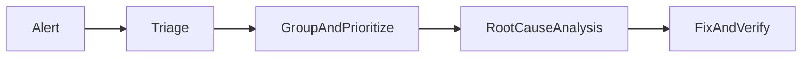

# Lesson 3: Error Analysis

## Learning Objectives

By the end of this lesson, you will be able to:
- Triage and analyze production errors using grouping, trends, and context
- Distinguish symptom vs root cause and avoid “fixing the wrong thing”
- Use stable error grouping strategies (types/codes) instead of brittle message matching
- Perform lightweight root-cause analysis (RCA) with actionable outputs
- Avoid common pitfalls (noisy grouping, missing reproduction steps, not verifying fixes)

## Why Error Analysis Matters

Monitoring tells you something is wrong. Analysis tells you what to fix first.

Good analysis reduces:
- time-to-diagnose
- time-to-fix
- repeat incidents



## Error Grouping

Grouping similar errors helps you:
- see top issues by frequency
- measure impact and regressions

Naive message matching works for demos but is brittle:

```typescript
function groupError(error: Error): string {
  if (error.message.includes("database")) return "database";
  if (error.message.includes("network")) return "network";
  return "unknown";
}
```

### Better approach: stable codes and types

Prefer:
- custom error classes (`DatabaseConnectionError`)
- stable error codes (`DB_CONN_FAILED`)
- tags (route, environment, release)

This prevents one issue being split into many groups due to minor message differences.

## Error Trends

Trends show whether errors are:
- new regressions (spike after deploy)
- chronic issues (steady noise)
- incident-driven (sudden surge)

```typescript
const errorTrends = {
  hourly: new Map<number, number>(),
  daily: new Map<string, number>(),
};

function trackErrorTrend() {
  const hour = new Date().getHours();
  const count = errorTrends.hourly.get(hour) || 0;
  errorTrends.hourly.set(hour, count + 1);
}
```

## Root Cause Analysis (RCA)

RCA should answer:
- what happened?
- why did it happen?
- how do we prevent it?

```typescript
function analyzeError(error: Error, context: any) {
  return {
    message: error.message,
    stack: error.stack,
    context,
    timestamp: new Date().toISOString(),
    user: context.user,
    request: context.request,
  };
}
```

### What “good context” looks like

- requestId
- route/method/status
- userId/tenantId (when available)
- release/environment
- key identifiers (not full sensitive payloads)

## Real-World Scenario: “Network Error” Isn’t the Root Cause

Symptoms:
- lots of “network error” reports

Possible root causes:
- DNS issues
- upstream outage
- TLS misconfig
- rate limiting/timeouts

Analysis requires correlation with:
- latency metrics
- upstream health
- traces and logs

## Best Practices

### 1) Triage by impact

Prioritize:
- affected users
- severity (outage vs minor issue)
- trend (spike vs steady)

### 2) Correlate with releases

If errors spike after deploy, suspect recent changes first.

### 3) Verify fixes

After deploying a fix:
- watch error trends
- add regression tests
- confirm the issue is resolved

## Common Pitfalls and Solutions

### Pitfall 1: Message-based grouping

**Problem:** same bug becomes many groups.

**Solution:** use stable error codes/types and consistent tags.

### Pitfall 2: Fixing symptoms

**Problem:** you suppress the error without addressing underlying cause.

**Solution:** trace back to the failing boundary (DB, external API, config, code path).

### Pitfall 3: No follow-up prevention

**Problem:** same incident repeats.

**Solution:** add tests, alerts, and runbooks based on RCA outcomes.

## Troubleshooting

### Issue: Production-only errors are hard to reproduce

**Symptoms:**
- happens only on production data/traffic

**Solutions:**
1. Use error tracking context + breadcrumbs to reproduce.
2. Add logs/metrics around suspected boundaries.
3. Create a staging dataset or synthetic reproduction.

## Next Steps

Now that you can analyze errors effectively:

1. ✅ **Practice**: Add stable error codes to your top operational errors
2. ✅ **Experiment**: Build a triage checklist (impact → trend → release correlation)
3. 📖 **Next**: Finish error tracking course and review overall course consistency
4. 💻 **Complete Exercises**: Work through [Exercises 06](./exercises-06.md)

## Additional Resources

- [Google SRE: Postmortems](https://sre.google/sre-book/postmortem-culture/)

---

**Key Takeaways:**
- Group and trend errors to prioritize fixes.
- Prefer stable error codes/types over brittle string matching.
- Good RCA focuses on root cause, prevention, and verification.
